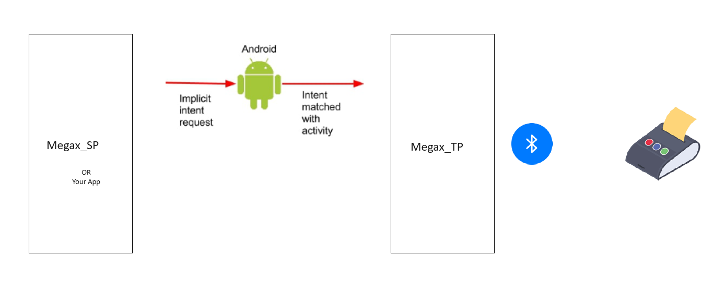

This Flutter App serves as a Passive thermal-print service for any other App that need to use thermal printing capabilities.
Passive means you dont need to run it, it can be fired throughout android Intents.

## Getting Started

the project uses the following dependencies, thus dont forget to add it if you decide to clone this project

-Permission -dependency
flutter pub add permission_handler

-Bluetooth pakage - dependency
flutter pub add print_bluetooth_thermal

-Thermal pakage - dependency
flutter pub add esc_pos_utils
flutter pub add esc_pos_utils_plus

-intent -dependency
flutter pub add receive_intent

## To test this Project
Firstly: you need to build and deploy this project to your android device, you can use the command
"flutter build apk" OR "flutter run" after cloning this project to your local development workspace.

Alternatively, this App is available in Google Play Store, so you need only to serach it and install it.

Secondly: you need to send an Intent to this program, the intent should be constructed like follows

String uri = "MEGAX,x,...,x";
Where x is the Base64String of your image

your uri should include at least one Base64String  of an image, thus it will looks like this: 
String uri = "MEGAX,x";

here is an example of what I use to send an Action Intent from MAUI written program

try
{
    string uri = "MEGAX," + Base64String_Img1 + "," + Base64String_Img2;
    Intent sendIntent = new Intent();
    sendIntent.SetAction(Intent.ActionSend);
    sendIntent.SetAction("RECEIVE_INTENT_EXAMPLE_ACTION");
    sendIntent.PutExtra(Intent.ExtraText, uri);
    MainActivity.StartActivity(sendIntent);
}
catch (Exception ex)
{
    System.Diagnostics.Debug.WriteLine(ex.Message);
};

Thats it, feel free to use the project if you feel to! : )

## Future Work
- Localization and adding supported languages for GUI (Deutsch,Arabic,etc..)
- send a reply to the Intent sending program (the caller Program), to inform whether the printing is completed successfully or not
- Accept HTML printing and not only Images

